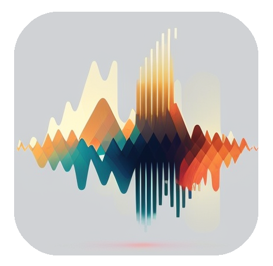

# Demooder

   

<p align="center">
     
</p>

Android application using input sound to recognize voice.

## Release
`
in progress
`

## Technologies
Application:
- Kotlin 1.9.22
- Java 11
- Android SDK 34
- Gradle 8.2 (KMP limited)
- Kotlin Multiplatform 1.9.22
- Jetpack Compose 1.6.10
- Python 3.8.20
- Numpy 1.23.3
- Keras 2.10.0
- cuda 11.2
- cuDNN 8.1.0


## Executing
1. Clone repository:
```agsl
https://github.com/ExaggeratedRumors/demooder.git
```
2. Download AudioWav data: <a href="https://www.kaggle.com/api/v1/datasets/download/ejlok1/cremad">Download from Kaggle</a>.
3. Unzip Wav files in `data_audio` directory (from root it's `demooder-model/data_audio` directory).
4. [optional] Run data augmentation task:
```bash
./gradlew :processing:dataAugmentation
```
5. Run create spectrograms task:
```bash
./gradlew :processing:createSpectrograms
```
Output spectrograms are saved in `data/spectrograms` directory.

## Sound data
- <a href="https://cheyneycomputerscience.github.io/CREMA-D/">CREMA-D</a>
- <a href="https://www.kaggle.com/datasets/uwrfkaggler/ravdess-emotional-speech-audio">RAVDESS</a>
- <a href="https://www.kaggle.com/datasets/barelydedicated/savee-database">SAVEE</a>
- <a href="https://www.kaggle.com/datasets/ejlok1/toronto-emotional-speech-set-tess">TESS</a>

## Audio data augmentation
1. Audio data augmentation: <a href="https://medium.com/@notabelardoriojas/environmental-sound-classification-investigating-different-spectrograms-and-audio-augmentation-95f6989d0ae5">about audio data augmentation</a>.
2. Gaussian noise.
3. Time stretching.

## Sound signal processing
1. Read WAV files according to the header scheme: <a href="http://soundfile.sapp.org/doc/WaveFormat/">wav file format</a>.
2. Audio signal resampling (check whether the signal is big-endian or little-endian): <a href="https://en.wikipedia.org/wiki/Sample-rate_conversion">about resampling</a>.
3. Optional gaussian noise reducing.
4. Convert byte data to complex.
5. Signal windowing: <a href="https://download.ni.com/evaluation/pxi/Understanding%20FFTs%20and%20Windowing.pdf">about windowing</a>.
6. Use Short-Time Fourier Transform (STFT): <a href="https://brianmcfee.net/dstbook-site/content/ch09-stft/STFT.html">about STFT</a>, <a href="https://www.ni.com/docs/en-US/bundle/diadem/page/genmaths/genmaths/calc_fouriertransform.html">about FFT</a>.
7. Optional filtering by A-weighting or C-weighting: <a href="https://www.noisemeters.com/help/faq/frequency-weighting/">about weighting</a>.
8. Optional converting signal to decibels and lower spectrum.

## Predicting in JVM
1. Read classifier model.
2. Record voice signal.
3. Save as WAV file. 
4. Down-sampling signal from 48000Hz to 16000Hz: <a href="https://gist.github.com/mattmalec/6ceee1f3961ff3068727ca98ff199fab">about resampling</a>.
5. Convert byte data to complex.
6. Signal windowing and filter by weighting.
7. Predict.

## Predicting in Android
1. Convert TF model to ONNX.
2. Record voice signal.
3. Downsample signal from 48000Hz to 16000Hz.
4. Convert byte data to complex.
5. Convert signal to spectrogram bitmap.
6. Predict.

## Visualizing
1. Read data.
2. Use FFT.
3. Convert FFt to spectral amplitude.
4. Convert to octave/thirds bands: <a href="https://sengpielaudio.com/calculator-octave.htm">about octave to third conversion</a>.
5. Filter by A-weighting or C-weighting.


## Additional requirements
1. CUDA for training model on GPU (Nvidia graphics cards): <a href="https://developer.nvidia.com/compute/machine-learning/cudnn/secure/7.6.3.30/Production/10.0_20190822/cudnn-10.0-windows10-x64-v7.6.3.30.zip">download CUDA</a>.
2. NNAPI for mobile devices environment acceleration: <a href="https://blog.jetbrains.com/kotlin/2022/12/kotlindl-0-5-has-come-to-android">about inference on Android </a>.
3. Upgrade for Conda environment during DLL initialization error for converter module:
```agsl
conda install conda-forge::vs2015_runtime
```
